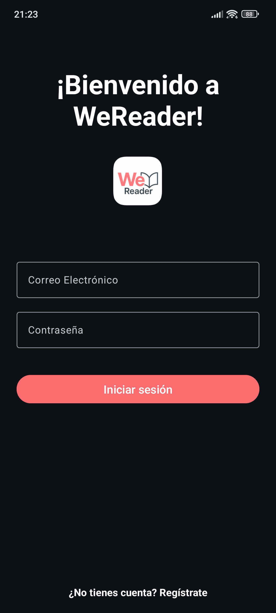
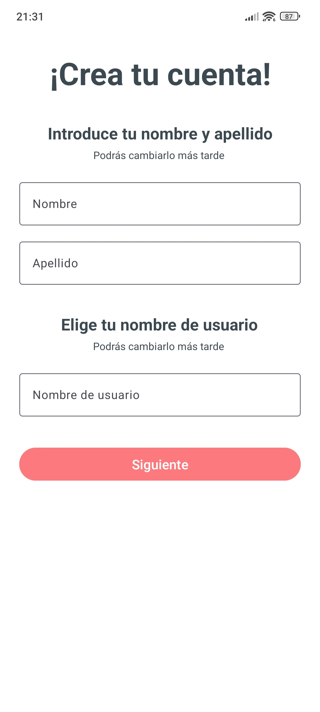
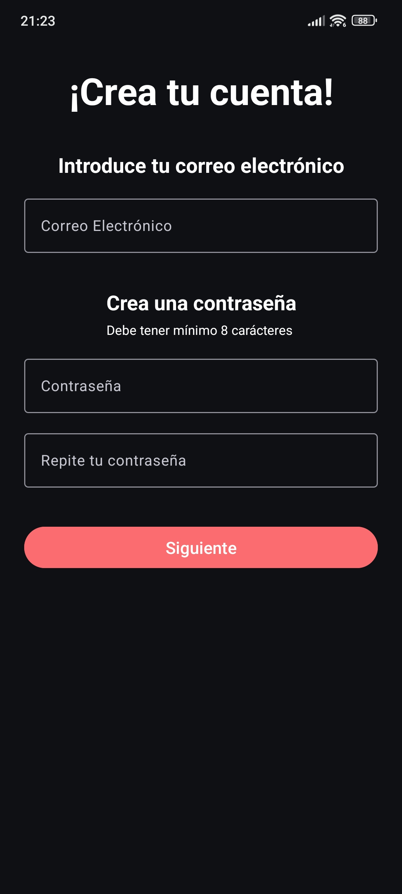
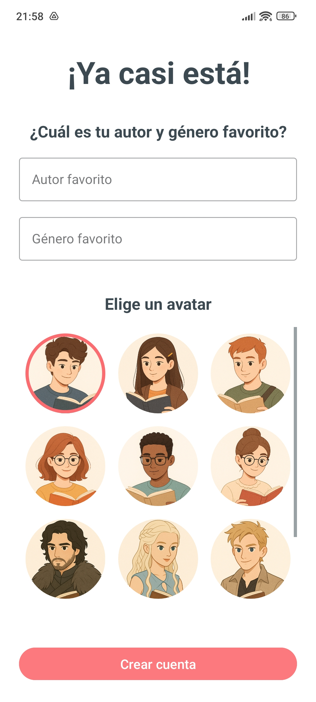
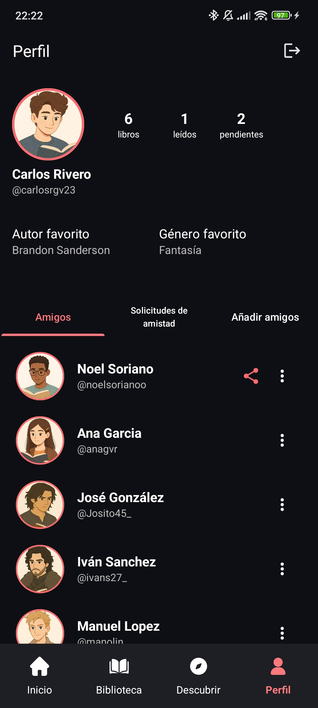
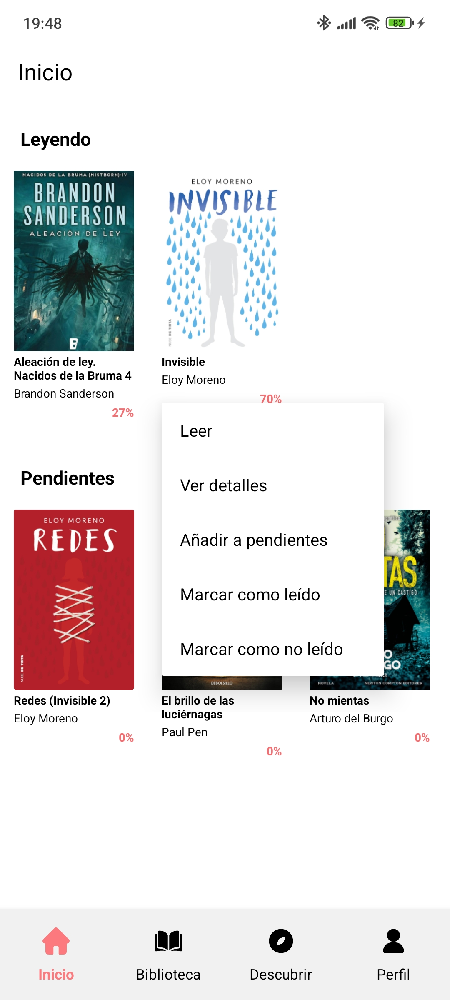
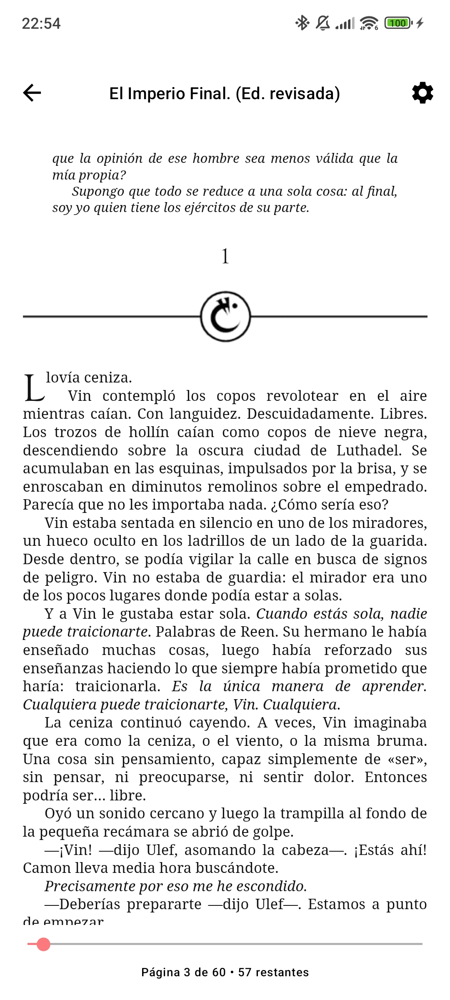
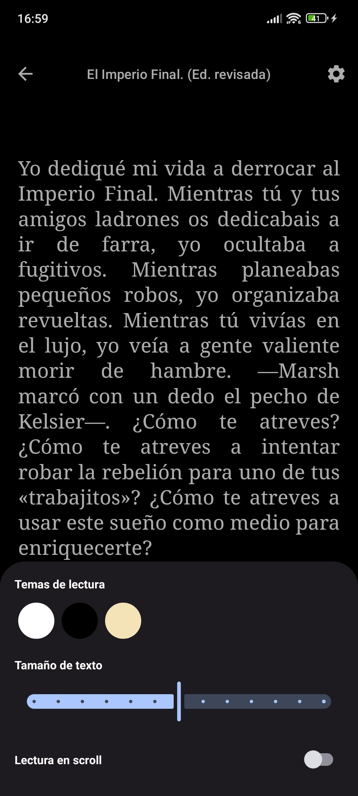
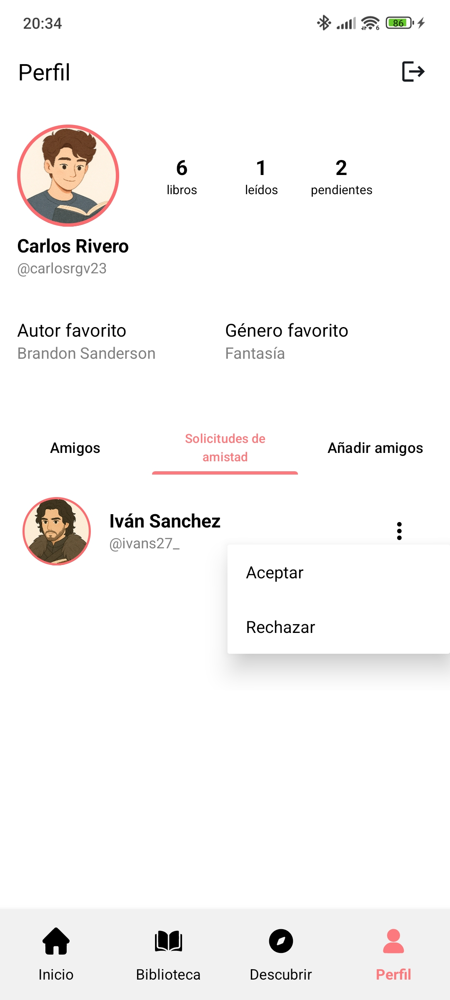
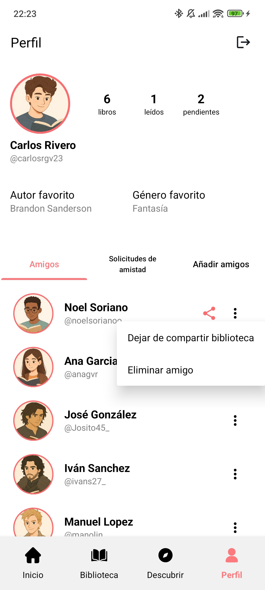

<p align="center">
  
</p>

# WeReader Android

WeReader es una aplicacion Android para descubrir, comprar, organizar y leer libros en formato EPUB. Este README documenta el cliente Android de forma independiente: pantallas, flujos, arquitectura interna, componentes, persistencia local, configuracion y ejecucion.

La app consume una API externa y usa Firebase Storage para descargar portadas y archivos EPUB, pero el foco de esta documentacion es el front Android.

El proyecto esta construido con Kotlin, Android Views, ViewBinding, Room, Retrofit, Firebase y Readium Kotlin Toolkit.


## Vista previa

▶️ [Video de ejecucion de la app](https://drive.google.com/file/d/13_eyR4fqAnS9hY2ukw5AWpcFcIuBLRBw/view?usp=sharing)

| Login | Registro 1 | Registro 2 | Registro 3 | Perfil
| --- | --- | --- | --- | --- |
|  |  |  |  |  |

| Inicio | Tienda | Detalle | Lectura | Opciones Lectura |
| --- | --- | --- | --- | --- |
|  |  |  |  |  |

| Biblioteca | Biblioteca compartida | Solicitudes | Compartir biblioteca | Buscar amigos
| --- | --- | --- | --- | --- |
|  |  |  |  |  |

## Tabla de contenidos

- [Funcionalidades](#funcionalidades)
- [Mapa de navegacion](#mapa-de-navegacion)
- [Pantallas y responsabilidades](#pantallas-y-responsabilidades)
- [Componentes reutilizables](#componentes-reutilizables)
- [Arquitectura](#arquitectura)
- [Tecnologias principales](#tecnologias-principales)
- [Estructura del proyecto](#estructura-del-proyecto)
- [Requisitos](#requisitos)
- [Configuracion](#configuracion)
- [Ejecucion](#ejecucion)
- [Pruebas](#pruebas)
- [Integracion con servicios externos](#integracion-con-servicios-externos)
- [Persistencia local](#persistencia-local)
- [Firebase Storage](#firebase-storage)
- [Estado actual y notas de mantenimiento](#estado-actual-y-notas-de-mantenimiento)

## Funcionalidades

### Autenticacion y registro

- Inicio de sesion mediante email y contrasena.
- Registro en tres pasos:
  - datos personales y nombre de usuario;
  - email y contrasena;
  - autor favorito, genero favorito y avatar.
- Validacion local de campos antes de enviar datos.
- Almacenamiento del token JWT y del ID de usuario en `SharedPreferences`.
- Validacion de expiracion del JWT antes de entrar a las pantallas privadas.
- Cierre de sesion desde el perfil.

### Inicio

- Pantalla principal con navegacion inferior.
- Listado horizontal de libros en lectura.
- Listado horizontal de libros pendientes.
- Acceso directo al lector desde los libros mostrados.
- Menu contextual de libro para:
  - leer;
  - ver detalles;
  - anadir o quitar de pendientes;
  - marcar como leido o no leido.

### Biblioteca

- Pestana de libros propios.
- Pestana de biblioteca compartida por amigos.
- Sincronizacion con la API y cache local en Room.
- Separacion local entre libros propios (`mine = true`) y libros compartidos (`mine = false`).
- Persistencia de estados locales:
  - pendiente;
  - en lectura;
  - progreso de lectura;
  - ultimo localizador del EPUB.

### Descubrir

- Secciones de libros:
  - mas vendidos;
  - nuevos lanzamientos;
  - recomendados.
- Busqueda de libros por texto.
- Acceso a detalle de libro desde resultados y carruseles.

### Detalle de libro

- Visualizacion de portada, titulo, autor, genero, sinopsis, ISBN, fecha de publicacion y compatibilidad con biblioteca compartida.
- Vista de libro de tienda:
  - muestra precio;
  - permite comprar/anadir el libro a la biblioteca del usuario.
- Vista de libro de biblioteca:
  - muestra progreso de lectura;
  - permite abrir el lector;
  - permite cambiar estado de pendiente y marcar como leido/no leido.

### Lector EPUB

- Descarga de archivos EPUB desde Firebase Storage.
- Cache local del EPUB en el almacenamiento externo privado de la app.
- Apertura y navegacion de EPUB con Readium.
- Restauracion de la posicion de lectura mediante `Locator`.
- Guardado automatico del progreso.
- Barra de progreso con salto a una posicion aproximada del libro.
- Preferencias del lector:
  - tema claro;
  - tema oscuro;
  - tema sepia;
  - tamano de fuente;
  - modo scroll.
- Apertura de enlaces externos en navegador.

### Perfil y componente social

- Visualizacion del perfil del usuario:
  - nombre completo;
  - tag;
  - avatar;
  - autor favorito;
  - genero favorito;
  - total de libros;
  - libros pendientes;
  - libros finalizados.
- Listado de amigos.
- Busqueda de usuarios por tag.
- Envio de solicitudes de amistad.
- Gestion de solicitudes recibidas:
  - aceptar;
  - rechazar.
- Eliminacion de amistades.
- Comparticion de biblioteca con un amigo.
- Cancelacion de biblioteca compartida.

## Mapa de navegacion

La aplicacion usa Activities como pantallas principales y una barra inferior para las secciones privadas.

```text
Launcher
   |
   v
MainActivity
   |
   |-- si no hay token valido --> LoginActivity
   |                                |
   |                                |-- RegisterActivity
   |                                      |
   |                                      |-- Step 1: datos personales
   |                                      |-- Step 2: credenciales
   |                                      |-- Step 3: preferencias y avatar
   |
   |-- nav_home      --> MainActivity
   |-- nav_library   --> LibraryActivity
   |-- nav_discover  --> DiscoverActivity
   |-- nav_profile   --> ProfileActivity
```

Flujos secundarios:

```text
LibraryActivity / MainActivity
   |
   |-- click libro --> ReaderActivity --> EpubReaderFragment
   |-- detalle ----> BookDetailActivity

DiscoverActivity
   |
   |-- buscar -----> BookSearchFragment
   |-- click libro -> BookDetailActivity en modo tienda

ProfileActivity
   |
   |-- Amigos
   |-- Solicitudes recibidas
   |-- Anadir amigos
```

## Pantallas y responsabilidades

### `LoginActivity`

Responsable de autenticar al usuario.

- Infla `activity_login.xml`.
- Comprueba si ya existe un token valido al reanudar la pantalla.
- Permite navegar a registro.
- Llama a `AuthViewModel.login`.
- Guarda sesion indirectamente mediante `AuthViewModel` y `SessionManager`.

### `RegisterActivity`

Responsable del alta de usuario mediante ViewPager2 sin swipe manual.

- Infla `activity_register.xml`.
- Usa `RegisterPagerAdapter`.
- Controla avance y retroceso entre pasos.
- Construye un `RegisterRequest` compartido entre fragments.
- Tras registro correcto hace login automatico y limpia la pila de Activities.

Fragments del registro:

- `RegisterStep1Fragment`: nombre, apellido y nombre de usuario/tag.
- `RegisterStep2Fragment`: email, repeticion de email, contrasena y repeticion.
- `RegisterStep3Fragment`: autor favorito, genero favorito y avatar.

### `MainActivity`

Pantalla de inicio privada.

- Infla `activity_main.xml`.
- Configura navegacion inferior.
- Muestra libros en lectura.
- Muestra libros pendientes.
- Usa dos instancias de `BooksAdapter`.
- Abre `ReaderActivity` con `bookPath` y `bookId`.
- Muestra `BookMenuHandler` en pulsacion larga.

### `LibraryActivity`

Contenedor de la biblioteca.

- Infla `activity_library.xml`.
- Configura navegacion inferior.
- Configura `TabLayout` + `ViewPager2`.
- Usa `LibraryPagerAdapter`.
- Actualmente muestra dos pestanas:
  - `LibraryFragment`: libros propios.
  - `SharedLibraryFragment`: libros compartidos con el usuario.

### `LibraryFragment`

Listado de libros propios.

- Observa `LibraryViewModel.myBooks`.
- Muestra estado vacio si no hay libros.
- Abre el lector al pulsar un libro.
- Muestra opciones de libro con pulsacion larga.

### `SharedLibraryFragment`

Listado de libros compartidos por amigos.

- Observa `LibraryViewModel.sharedBooks`.
- Muestra estado vacio si no hay biblioteca compartida.
- Reutiliza `BooksAdapter` y `BookMenuHandler`.

### `DiscoverActivity`

Pantalla de descubrimiento/tienda.

- Infla `activity_discover.xml`.
- Configura navegacion inferior.
- Carga tres carruseles horizontales:
  - bestsellers;
  - nuevos lanzamientos;
  - recomendados.
- Usa `BooksDiscoverAdapter`.
- Abre `BookDetailActivity` en modo tienda.
- Desde el menu de toolbar abre `BookSearchFragment`.

### `BookSearchFragment`

Busqueda de libros dentro de la seccion descubrir.

- Infla `fragment_book_search.xml`.
- Usa `BookSearchAdapter`.
- Escucha cambios del campo de busqueda con `doAfterTextChanged`.
- Limpia resultados cuando el texto esta vacio.
- Abre el detalle del libro en modo tienda.

### `BookDetailActivity`

Pantalla de detalle reutilizada para dos contextos:

- `EXTRA_IS_STORE_BOOK = true`: libro de tienda.
- `EXTRA_IS_STORE_BOOK = false`: libro de biblioteca local.

Elementos comunes:

- portada;
- titulo;
- autor;
- genero;
- sinopsis;
- fecha;
- ISBN;
- indicador de libro compartible.

Modo tienda:

- obtiene el libro desde remoto;
- muestra precio;
- muestra boton `Comprar`;
- anade el libro a la biblioteca.

Modo biblioteca:

- obtiene el libro desde Room con LiveData;
- muestra progreso;
- muestra boton de lectura;
- permite acciones de toolbar sobre pendiente/leido/no leido.

### `ReaderActivity`

Contenedor del lector.

- Recibe `bookPath` y `bookId`.
- Aplica tema visual inicial segun preferencias guardadas.
- Descarga el EPUB desde Firebase Storage si no esta cacheado.
- Guarda el EPUB en `getExternalFilesDir("epubs")`.
- Carga la publicacion en `ReaderViewModel`.
- Inserta `EpubReaderFragment`.

### `EpubReaderFragment`

Interfaz de lectura EPUB.

- Usa `EpubNavigatorFactory` y `EpubNavigatorFragment` de Readium.
- Restaura la lectura desde `ReaderViewModel.initialLocator`.
- Observa `navigator.currentLocator`.
- Calcula porcentaje, pagina actual aproximada y paginas restantes.
- Guarda progreso y locator.
- Permite mover la barra de progreso y saltar a una progresion.
- Abre `ReaderPreferencesFragment`.
- Abre enlaces externos con `Intent.ACTION_VIEW`.

### `ReaderPreferencesFragment`

Bottom sheet de preferencias de lectura.

- Permite cambiar tema.
- Permite cambiar tamano de fuente.
- Permite activar/desactivar scroll.
- Aplica cambios al navegador Readium.
- Guarda preferencias en `ReaderPreferencesManager`.

### `ProfileActivity`

Pantalla de perfil y zona social.

- Infla `activity_profile.xml`.
- Muestra datos del usuario autenticado.
- Muestra contadores de biblioteca.
- Renderiza avatar local con Glide.
- Permite cerrar sesion.
- Configura tabs con `ProfilePagerAdapter`.

Tabs del perfil:

- `FriendsFragment`: listado y acciones sobre amigos.
- `FriendRequestFragment`: solicitudes recibidas.
- `AddFriendFragment`: busqueda de usuarios y envio de solicitud.

### `FullscreenActivity`

Activity generada de ejemplo. No esta conectada al flujo principal de WeReader.

## Componentes reutilizables

### Adapters

- `BooksAdapter`: renderiza libros de biblioteca en home, biblioteca propia y biblioteca compartida.
- `BooksDiscoverAdapter`: renderiza carruseles de descubrimiento.
- `BookSearchAdapter`: renderiza resultados de busqueda.
- `FriendshipAdapter`: renderiza amigos, solicitudes y resultados sociales segun modo.
- `AvatarAdapter`: renderiza avatares seleccionables durante el registro.
- `LibraryPagerAdapter`: conecta tabs de biblioteca con fragments.
- `ProfilePagerAdapter`: conecta tabs de perfil con fragments.
- `RegisterPagerAdapter`: conecta pasos de registro.

### Menus y handlers

- `BookMenuHandler`: menu contextual de libro para leer, ver detalle, cambiar pendiente y marcar leido/no leido.
- `FriendMenuHandler`: menu contextual de amigo para compartir/dejar de compartir biblioteca o eliminar amistad.
- `FriendRequestsMenuHandler`: menu contextual de solicitud para aceptar o rechazar.

### Gestores de estado local

- `SessionManager`: token, userId y estado de comparticion de biblioteca.
- `ReaderPreferencesManager`: preferencias del lector EPUB.
- `AvatarProvider`: catalogo local de avatares.

### Recursos de interfaz

- Layouts XML en `app/src/main/res/layout`.
- Menus en `app/src/main/res/menu`.
- Iconos vectoriales y placeholders en `app/src/main/res/drawable`.
- Avatares en `app/src/main/res/drawable/avatar*.png`.
- Iconos launcher en `app/src/main/res/mipmap-*`.
- Colores, temas y strings en `app/src/main/res/values`.

## Arquitectura

El proyecto sigue una arquitectura por capas sencilla:

```text
UI Activity/Fragment
        |
     ViewModel
        |
   Repository
        |
DataSource remoto/local
        |
Retrofit API / Room DB / SharedPreferences / Firebase Storage
```

### Capa de UI

La interfaz esta implementada con Activities, Fragments, RecyclerViews, ViewPager2, TabLayout, Material Components y ViewBinding.

Pantallas principales:

- `MainActivity`: inicio, libros en lectura y pendientes.
- `LibraryActivity`: biblioteca propia y biblioteca compartida.
- `DiscoverActivity`: descubrimiento y busqueda.
- `BookDetailActivity`: detalle, compra y acciones sobre libro.
- `ReaderActivity` + `EpubReaderFragment`: lectura EPUB.
- `ProfileActivity`: perfil, amigos y solicitudes.
- `LoginActivity` y `RegisterActivity`: autenticacion.

### Capa de ViewModel

Los ViewModels coordinan el estado de pantalla y las llamadas a repositorios:

- `AuthViewModel`
- `MainViewModel`
- `LibraryViewModel`
- `DiscoverViewModel`
- `BookSearchViewModel`
- `BookDetailViewModel`
- `ReaderViewModel`
- `ProfileViewModel`
- `FriendsViewModel`
- `FriendRequestsViewModel`
- `AddFriendViewModel`

### Capa de datos

- `Repository`: concentra reglas de acceso a datos.
- `RemoteDataSource`: encapsula llamadas Retrofit.
- `LocalDataSource`: encapsula consultas Room.
- `SessionManager`: gestiona sesion y estado de comparticion en `SharedPreferences`.

## Tecnologias principales

- Kotlin
- Android Gradle Plugin 8.6.0
- Gradle Wrapper 8.7
- Android SDK:
  - `minSdk`: 26
  - `targetSdk`: 35
  - `compileSdk`: 35
- AndroidX
- Material Components
- ViewBinding
- Lifecycle ViewModel y LiveData
- Kotlin Coroutines y Flow
- Retrofit 2 + Gson Converter
- OkHttp Interceptor para token Bearer
- Room 2.7.1
- Firebase:
  - Authentication KTX
  - Analytics
  - Storage KTX
- Glide
- Auth0 JWT Decode
- Readium Kotlin Toolkit 3.1.0

## Estructura del proyecto

```text
.
|-- app/
|   |-- build.gradle.kts
|   |-- google-services.json
|   `-- src/
|       |-- main/
|       |   |-- AndroidManifest.xml
|       |   |-- java/tfg/carlos/wereaderapp/
|       |   |   |-- data/
|       |   |   |   |-- entity/
|       |   |   |   |-- local/
|       |   |   |   |-- model/
|       |   |   |   |-- remote/
|       |   |   |   `-- repository/
|       |   |   |-- ui/
|       |   |   |   |-- auth/
|       |   |   |   |-- avatar/
|       |   |   |   |-- bookDetail/
|       |   |   |   |-- discover/
|       |   |   |   |-- library/
|       |   |   |   |-- main/
|       |   |   |   |-- profile/
|       |   |   |   `-- reader/
|       |   |   |-- utils/
|       |   |   `-- WeReaderApplication.kt
|       |   `-- res/
|       |       |-- drawable/
|       |       |-- layout/
|       |       |-- menu/
|       |       |-- mipmap*/
|       |       |-- values/
|       |       `-- xml/
|       |-- test/
|       `-- androidTest/
|-- gradle/
|   |-- libs.versions.toml
|   `-- wrapper/
|-- build.gradle.kts
|-- settings.gradle.kts
`-- README.md
```

## Requisitos

- Android Studio compatible con AGP 8.6.0.
- JDK 17 recomendado para builds modernos de Android.
- Android SDK 35 instalado.
- Dispositivo o emulador con Android 8.0/API 26 o superior.
- Servicio API de WeReader levantado y accesible desde el dispositivo/emulador.
- Proyecto Firebase configurado para el paquete `tfg.carlos.wereaderapp`.

## Configuracion

### 1. Servicio API

La URL base esta definida en:

```kotlin
app/src/main/java/tfg/carlos/wereaderapp/data/remote/Retrofit2Api.kt
```

Valor actual:

```kotlin
private const val BASE_URL = "http://192.168.1.139:3000/"
```

Para ejecutar contra otro entorno, cambia ese valor por la URL correspondiente. Ejemplos habituales:

- Servicio local desde emulador Android: `http://10.0.2.2:3000/`
- Servicio en red local desde dispositivo fisico: `http://<IP_LOCAL>:3000/`
- Servicio desplegado: `http://wereader.es:80/` o el dominio configurado.

La app permite trafico HTTP en desarrollo para estos dominios/IPs:

```xml
app/src/main/res/xml/network_security_config.xml
```

Dominios configurados actualmente:

- `wereader.es`
- `192.168.1.139`
- `10.0.2.2`

Si se cambia la URL base a otro host HTTP, tambien hay que anadirlo a `network_security_config.xml` o usar HTTPS.

### 2. Firebase

La app usa Firebase Storage para resolver portadas y descargar EPUBs. El archivo de configuracion esperado es:

```text
app/google-services.json
```

Debe corresponder al paquete:

```text
tfg.carlos.wereaderapp
```

Las rutas de portada y EPUB llegan desde la API y se interpretan como paths dentro de Firebase Storage.

### 3. Sesion

La sesion se guarda con `SessionManager` en `SharedPreferences`:

- token JWT;
- ID de usuario extraido del claim `sub`;
- estado de biblioteca compartida;
- ID del usuario con quien se comparte biblioteca.

Las peticiones autenticadas usan un interceptor de OkHttp que anade:

```http
Authorization: Bearer <token>
```

## Ejecucion

Desde Android Studio:

1. Abrir el proyecto.
2. Sincronizar Gradle.
3. Revisar la URL del servicio API en `Retrofit2Api.kt`.
4. Verificar que `google-services.json` existe en `app/`.
5. Ejecutar la configuracion `app` en un emulador o dispositivo.

Desde terminal:

```bash
./gradlew assembleDebug
```

En Windows:

```powershell
.\gradlew.bat assembleDebug
```

APK generado:

```text
app/build/outputs/apk/debug/app-debug.apk
```

## Pruebas

Pruebas unitarias locales:

```bash
./gradlew test
```

En Windows:

```powershell
.\gradlew.bat test
```

Pruebas instrumentadas:

```bash
./gradlew connectedAndroidTest
```

En Windows:

```powershell
.\gradlew.bat connectedAndroidTest
```

Actualmente el proyecto incluye pruebas de ejemplo:

- `ExampleUnitTest`
- `ExampleInstrumentedTest`

## Integracion con servicios externos

El front Android consume servicios externos mediante Retrofit y Firebase. Esta seccion describe la integracion desde el punto de vista de Android.

### Cliente HTTP Android

La configuracion Retrofit vive en:

```text
app/src/main/java/tfg/carlos/wereaderapp/data/remote/Retrofit2Api.kt
```

Responsabilidades:

- define `BASE_URL`;
- crea un `OkHttpClient`;
- registra `AuthInterceptor`;
- expone servicios Retrofit por dominio funcional.

El interceptor agrega el token JWT a las peticiones cuando existe sesion:

```http
Authorization: Bearer <token>
```

### Servicios Retrofit usados por el front

#### Autenticacion

- Login.
- Registro.

#### Usuario

- Perfil del usuario autenticado.
- Busqueda de usuarios por tag.

#### Libros

- Mas vendidos.
- Nuevos lanzamientos.
- Recomendados.
- Detalle de libro.
- Busqueda de libros.

#### Biblioteca

- Biblioteca del usuario autenticado.
- Anadir libro a biblioteca.

#### Biblioteca compartida

- Bibliotecas compartidas con el usuario autenticado.
- Biblioteca compartida por el usuario autenticado.
- Compartir biblioteca con un amigo.
- Dejar de compartir biblioteca.

#### Amistades

- Crear solicitud de amistad.
- Listar amigos.
- Listar solicitudes recibidas.
- Aceptar solicitud.
- Rechazar solicitud.
- Eliminar amistad.

## Persistencia local

Room se inicializa en `WeReaderApplication` con la base de datos:

```text
WeReader-db
```

Base de datos:

```kotlin
LibraryDB
```

Version actual:

```kotlin
version = 9
```

Entidades:

- `BookEntity`: libros propios y compartidos, con estado local de lectura.
- `StoreBookEntity`: modelo local para libros de tienda.

Campos locales relevantes de `BookEntity`:

- `isPending`
- `isReading`
- `readingProgress`
- `mine`
- `idUser`
- `lastLocator`

La aplicacion usa `fallbackToDestructiveMigration()`, indicado en codigo como configuracion de desarrollo. Esto permite continuar durante cambios de esquema, pero borra datos locales si cambia la version de la base de datos sin migracion.

## Firebase Storage

La app usa Firebase Storage en dos puntos principales:

- Portadas: se obtiene una URL descargable con el path `coverUrl` recibido desde la API y se carga con Glide.
- EPUBs: se descarga el archivo indicado por `epubUrl` y se guarda localmente en:

```text
getExternalFilesDir("epubs")
```

Si el EPUB ya existe localmente, se reutiliza y no se vuelve a descargar.

## Estado actual y notas de mantenimiento

- La URL del servicio API esta hardcodeada en `Retrofit2Api.kt`; para entornos multiples seria recomendable moverla a `BuildConfig`, flavors o propiedades de Gradle.
- `network_security_config.xml` permite HTTP para desarrollo. En produccion conviene usar HTTPS.
- Room usa `fallbackToDestructiveMigration()`, practico en desarrollo pero no recomendable para produccion.
- `CollectionsFragment` existe como placeholder, pero la pestana de colecciones esta desactivada en `LibraryPagerAdapter`.
- `FullscreenActivity` parece ser una pantalla generada de ejemplo y no forma parte del flujo principal.
- `EpubSpeakerManager` contiene una implementacion comentada de lectura por voz con TextToSpeech; no esta activa actualmente.
- Las pruebas incluidas son las plantillas iniciales; faltan pruebas especificas de repositorios, ViewModels, validaciones y flujos principales.
<<<<<<< HEAD
=======

>>>>>>> f992107e4a7fa65c2d6b51c89768020bd7a761ba
